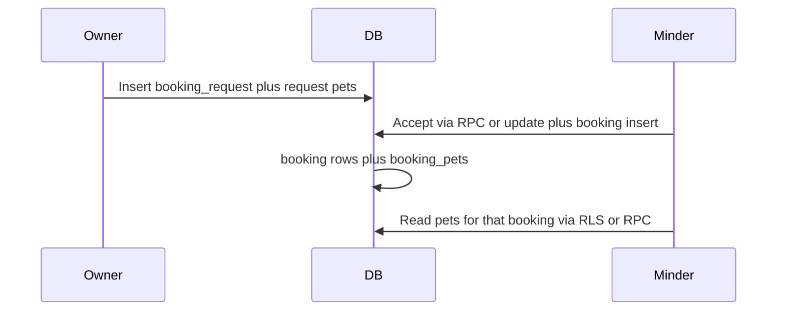

# Booking feature: database and app plan

## Documentation source

- There is **no `docs/` directory** in this workspace (search returned zero files). Treat **[domain-analysis-report.md](domain-analysis-report.md)** (tasks: request booking, accept/decline, cancel/reschedule, care instructions) and **[pet-minder/design.md](pet-minder/design.md)** (schema and UI rules) as the spec.
- UI work should follow **design.md** (tokens, `StatusBadge`, role-aware copy, no emoji in functional UI).

## Current database (verified via schema MCP)

| Area      | State                                                                                                                                                                                                                                                                                                                                                        |
| --------- | ------------------------------------------------------------------------------------------------------------------------------------------------------------------------------------------------------------------------------------------------------------------------------------------------------------------------------------------------------------ |
| Tables    | `booking_requests`, `bookings`, `booking_pets`, `minder_availability` exist with sensible columns (`requested_datetime`, `duration_minutes`, `start_datetime`/`end_datetime`, `cancellation_deadline`, `care_instructions`, etc.).                                                                                                                           |
| FKs       | `minder_id` → `minder_profiles.id`; `owner_id` → `users.id`; `bookings.request_id` → `booking_requests`.                                                                                                                                                                                                                                                     |
| Enums     | `booking_request_status`: pending, accepted, declined, cancelled; `booking_status`: pending, confirmed, cancelled, completed.                                                                                                                                                                                                                                |
| **Gap 1** | `**booking_pets`**: RLS **on**, **policy_count = 0** → no client access.                                                                                                                                                                                                                                                                                     |
| **Gap 2** | No way to attach **pets to a request** before acceptance; domain expects “pet(s) involved” at request time.                                                                                                                                                                                                                                                  |
| **Gap 3** | `**booking_requests` policy** `"booking_requests: parties only"` is **FOR ALL** with a broad `USING` that includes the minder branch; for **INSERT**, PostgreSQL can treat that as `WITH CHECK`, which may allow a **minder to insert a row with an arbitrary `owner_id`** (minder matches `minder_id`, first clause ignored). This should be **tightened**. |
| **Gap 4** | **Minders cannot read `pet_profiles`** for pets in an accepted booking under current owner-only pet RLS (needed for “view instructions” / session prep).                                                                                                                                                                                                     |

Repo migrations under [pet-minder/supabase/migrations/](pet-minder/supabase/migrations/) do **not** yet define booking tables (they exist only in your remote DB). New migration files should capture **deltas** you apply so the repo matches production.

## Database changes (SQL in a new migration; you run on the DB)

Deliver as one or two timestamped files in `pet-minder/supabase/migrations/` (British spelling in comments if you like).

### 1. Fix `booking_pets` RLS

Add explicit policies (names illustrative):

- **SELECT**: user is `bookings.owner_id` **or** minder user for `bookings.minder_id` (join `bookings` on `booking_id`).
- **INSERT**: same party check **and** `pet_profiles.owner_id = bookings.owner_id` (join `pet_profiles` on `pet_id`) so pets cannot be attached to someone else’s booking.
- **DELETE/UPDATE**: same party read as appropriate (often only owner or “pending” booking; keep minimal for MVP).

### 2. Model pets on requests

Add `**booking_request_pets`**:

- Columns: `request_id` (FK → `booking_requests` ON DELETE CASCADE), `pet_id` (FK → `pet_profiles`), `created_at`, PK `(request_id, pet_id)`.
- **RLS**: owner of the request (`booking_requests.owner_id = auth.uid()`) can manage rows; minder can **SELECT** for requests where they are the minder (for accept UI).

Optional: add `**care_instructions`** (text, nullable) on `booking_requests` so the free-text `message` stays for intro notes and care details match [domain-analysis-report.md](domain-analysis-report.md); copy into `bookings.care_instructions` on accept.

### 3. Harden `booking_requests` (and review `bookings`) RLS

Replace the single **FOR ALL** policy with split policies, for example:

- **SELECT**: owner or minder (unchanged intent).
- **INSERT**: `**WITH CHECK (auth.uid() = owner_id)`** plus FK/existence checks on `minder_id` (and optional role check for `owner`).
- **UPDATE**: owner may update **their** rows (e.g. cancel while `pending`); minder may update **their** rows (e.g. set `accepted` / `declined`) with checks on allowed status transitions.

For `**bookings`**, avoid a loose FOR ALL if it allows either party to invent rows: prefer SELECT/UPDATE for parties and either no INSERT for `authenticated` plus `**SECURITY DEFINER` RPC** for creation, or a very strict **INSERT WITH CHECK** tied to an accepted request (harder to get right than RPC).

### 4. Let minders read pets tied to a booking

Add `**pet_profiles` SELECT** policy: allow read when `deleted_at is null` and there exists a row in `booking_pets` joining to a `bookings` row where the current user is the minder (`minder_profiles.user_id = auth.uid()`). This supports “view instructions” without exposing all pets.

### 5. RPCs (your convention: prefix by page → `bookings_*`)

Implement `**SECURITY DEFINER`** functions (owned by a privileged role, `SET search_path = public`) to keep flows atomic and avoid RLS footguns:

| Function                                    | Purpose                                                                                                                                                                                                                                                                                                                                                                                |
| ------------------------------------------- | -------------------------------------------------------------------------------------------------------------------------------------------------------------------------------------------------------------------------------------------------------------------------------------------------------------------------------------------------------------------------------------- |
| `bookings_create_request(...)`              | Validates owner role, minder exists, pets belong to owner; inserts `booking_requests` + `booking_request_pets`.                                                                                                                                                                                                                                                                        |
| `bookings_accept_request(request_id uuid)`  | Verifies caller is the minder, status pending; sets request `accepted`; inserts `bookings` (`start_datetime`/`end_datetime` from request + duration), sets `**cancellation_deadline = start_datetime - interval '48 hours'`** per domain doc; copies `booking_request_pets` → `booking_pets`; sets booking status `confirmed` (or `pending` then confirm — align with enum semantics). |
| `bookings_decline_request(request_id uuid)` | Minder sets `declined`.                                                                                                                                                                                                                                                                                                                                                                |
| `bookings_cancel_request(request_id uuid)`  | Owner cancels while `pending`.                                                                                                                                                                                                                                                                                                                                                         |
| `bookings_cancel_booking(booking_id uuid)`  | Either party; **enforce `now() < cancellation_deadline`** and set status + `cancelled_at`.                                                                                                                                                                                                                                                                                             |

Grant **execute** to `authenticated`. Regenerate TypeScript types after deploy (`pnpm` script if present).

### 6. Optional later (not required for first slice)

- **Reschedule** as a dedicated state or linked follow-up request (domain mentions it; no column today).
- **Service type** enum on requests if you need “walk vs sit” explicitly.
- **Overlap / double-booking** prevention (exclusion constraint or trigger) once usage patterns are clear.

## Application work (after DB)

| Piece              | Location / notes                                                                                                                                                                                                                                                                                                                                                                                          |
| ------------------ | --------------------------------------------------------------------------------------------------------------------------------------------------------------------------------------------------------------------------------------------------------------------------------------------------------------------------------------------------------------------------------------------------------- |
| Request flow       | New route e.g. `[pet-minder/app/dashboard/minders/[profileId]/book/page.tsx](pet-minder/app/dashboard/minders/[profileId]/book/page.tsx)` or a sheet from `[pet-minder/app/dashboard/minders/[profileId]/page.tsx](pet-minder/app/dashboard/minders/[profileId]/page.tsx)`: datetime, duration, multi-select pets (`pet_profiles` for `auth.uid()`), message/care fields. Call `bookings_create_request`. |
| Owner bookings UI  | Extend `[pet-minder/components/bookings-page-content.tsx](pet-minder/components/bookings-page-content.tsx)`: list pending requests + upcoming/past bookings (Supabase queries or thin `lib/bookings-service.ts`).                                                                                                                                                                                         |
| Minder bookings UI | Same component, minder role: inbound requests with Accept / Decline calling RPCs; list confirmed bookings.                                                                                                                                                                                                                                                                                                |
| Types              | Add types for request/booking rows and RPC args; reuse `[pet-minder/components/ui/status-badge.tsx](pet-minder/components/ui/status-badge.tsx)` for statuses per design.md.                                                                                                                                                                                                                               |

## Verification

- After migration: confirm `booking_pets` and `booking_request_pets` show non-zero RLS policy counts and smoke-test insert/select as owner and minder in the Supabase SQL editor or app.
- Manually test: request → accept → `booking_pets` populated → minder can read linked `pet_profiles` → cancel before deadline.

